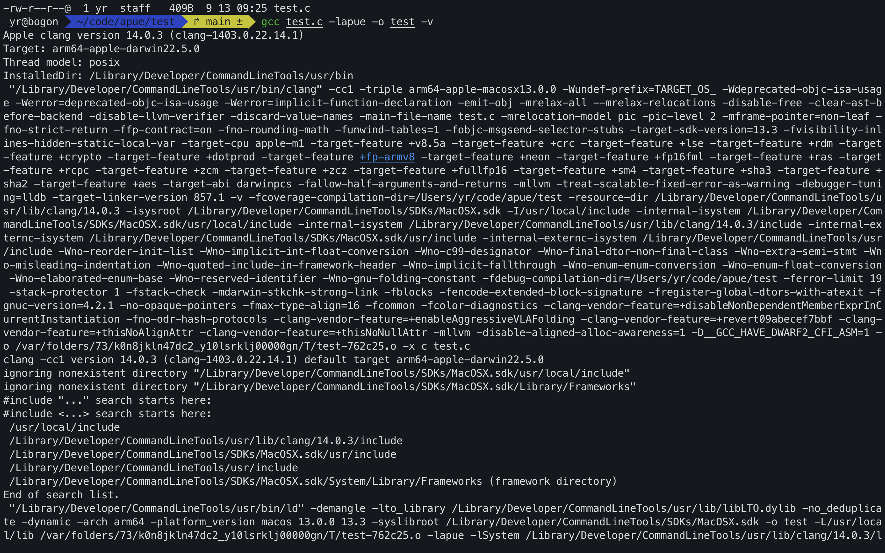

# apue环境配置 —— macos

环境配置的目的是使的我们能使用书中的`apue.h`头文件，包含该头文件与本书所有示例代码都可以在 http://www.apuebook.com/ 上下载，得到src.3e.tar.gz这样一个压缩文件

1. 通过`tar -zxvf src.3e.tar.gz`指令将文件解压,得到apue.3e文件夹。
2. 由于我们获得的是源代码，我们需要将源码编译，由于文件中提供了Makefile，直接通过`make`即可编译
3. “安装”本书相关库，在apue.3e的include目录下找到apue.h，将其拷贝进入系统的include目录，在lib目录下找到libapue.a拷贝到系统的bin目录下。

所谓“系统的include目录，系统的bin目录下”其实指gcc调用时编译器去哪个目录下找对应头文件，链接器去哪个目录找对应的动静态库（libapue.a为动态库）
我们可以通过gcc编译一个测试c程序时加入-v选项，找到gcc的寻找目录，下面两个即为我们安装自己库的目录。
/usr/local/include
/usr/local/bin
