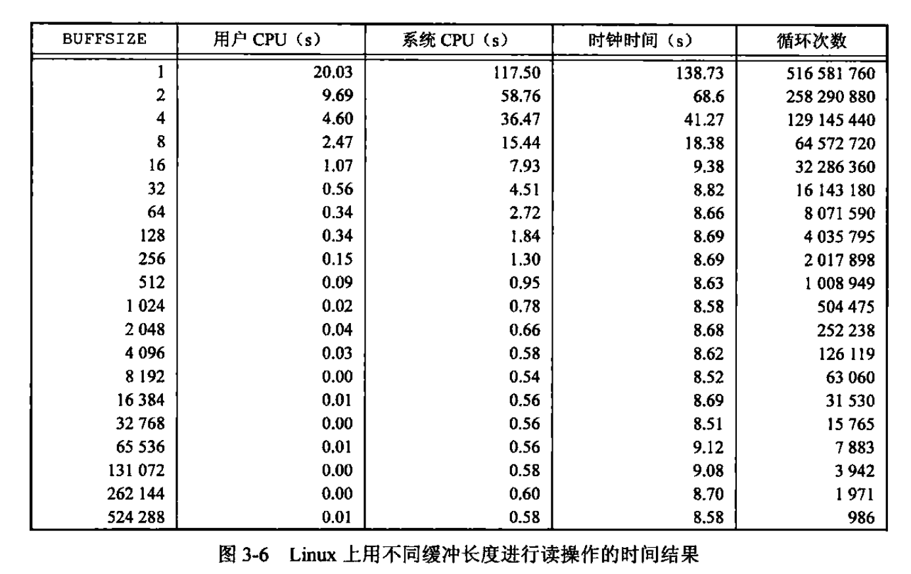
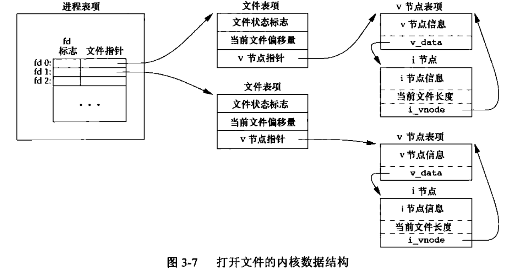
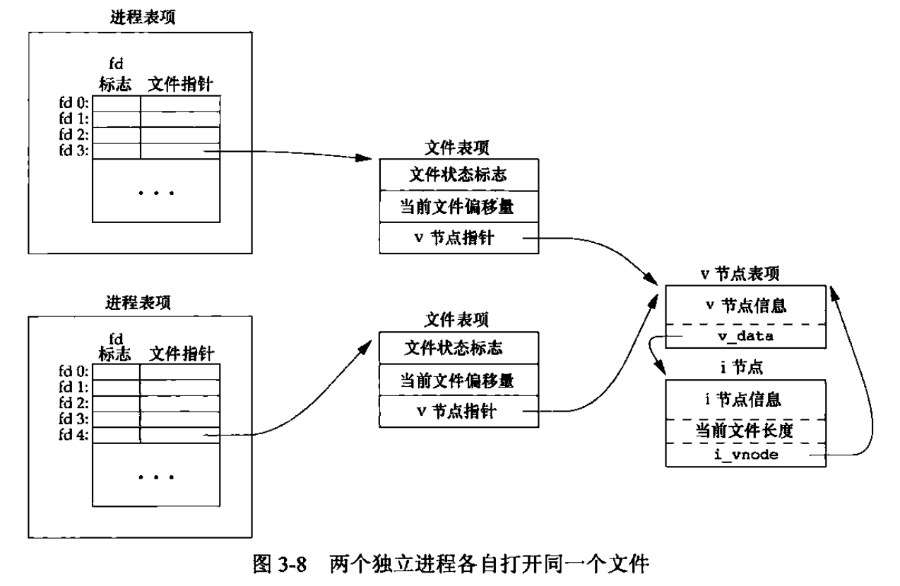
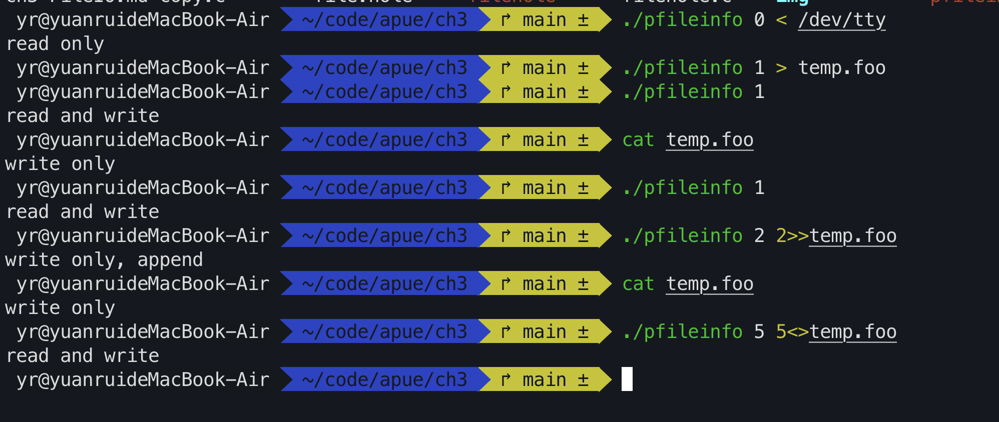

# 文件IO

### 1. Intro 

Unix下大多数文件IO用到的函数如下：

```c
int open(const char *path, int oflag, ...);
ssize_t write(int fildes, const void *buf, size_t nbyte);
ssize_t read(int fildes, void *buf, size_t nbyte);
off_t lseek(int fildes, off_t offset, int whence);
int close(int fildes);
```

上述函数均为System Call，与标准IO相比其不带缓冲（unbuffered IO）

### 2. 文件描述符（file descriptor）

对于kernel，所有打开的文件都通过文件描述符（以后简称fd）引用，fd是一个非负整数。———— 理解用文件描述符来引用文件：`open(),creat()`函数返回的`int`,即fd （kernel向进程返回一个文件描述符）。对于`read, write, lseek, close`函数传入的参数`fildes`即为fd

UNIX惯例下：
1. fd = 0 （STDIN_FILENO）  关联标准输入
2. fd = 1 （STDOUT_FILENO） 关联标准输出
3. fd = 2 （STDERR_FILENO） 关联标准错误

### 3.函数介绍

略，需要时去查文档


### 4.IO的效率

由于我们在用system call进行读写时不带缓冲，我们需要自己创建一个buffer（char型数组），此时如何选择BUFFSIZE就是一个问题，书中的实验数据表明4096字节为一个较为合适的选择。



### 5.文件共享

UNIX系统支持在不同进程间共享打开文件

内核使用三种数据结构(进程表项，文件表项，v节点表项)表示打开文件



两个独立进程各自打开同一文件



每一个进程都有自己的文件表项，其中也有其自己当前的文件偏移量，此时多进程读取同一文件都能正确工作，但是多进程写同一个文件，可能产生预想不到的结果

### 6. 原子操作（atomic operation）

原子操作指一个由多步组成的一个操作，其要么执行完所有的步骤，要么一步也不执行，不可能执行所有步骤的一个子集

1. 追加到一个文件的例子
    `lseek`到文件尾端后再`write` vs 打开文件时设置`O_APPEND`标志 （结合上述三个数据结构去理解）
    前者非原子操作，后者在追加时为原子操作
2. 函数`pread`和`pwrite`扩展允许原子性地定位并执行IO
    pread**相当于**调用lseek后调用read但是和顺序调用有区别：
    - 调用pread时，无法中断其定位和读操作
    - 不更新当前文件偏移量
    pwrite与上述类似

3. 创建文件O_CREAT和C_EXCL选项 vs open判断 + creat的例子


### 7. dup和dup2函数

### 8. 函数sync、fsync、fdatasync

理论：传统UNIX系统实现在内核中设有缓冲区高速缓存，或者页高速缓存，磁盘IO大多通过缓冲区进行。

机制：当我们向文件写入数据时，内核通常先将数据复制到缓冲区中，然后排入队列，晚些时候再写入磁盘————延迟写（delayed write） ———— 当我们做IO的时候，比如我们调用了write，此时数据并不是立刻到了磁盘或者输出设备，而是把数据从我们自己的缓冲区buf，**拷贝**到OS内核的缓冲区，最后由内核进行写入磁盘。（IO的本质其实就是拷贝，从将数据从用户缓冲区拷贝到内核缓冲区）


### 9. 函数fcntl (file control)

函数原型
```c
#include <fcntl.h>
int fcntl(int fd, int cmd, .../*int arg*/)
```

`fcntl`有一下五种功能：
1. 复制一个已有的描述符（cmd = F_DUPFD or F_DUPFD_CLOEXEC）
2. 获取/设置文件描述符状态(cmd = F_GETFD or cmd = F_SETFD)
3. 获取/设置文件状态标志(cmd = F_GETFL or cmd = F_SETFL)
4. 获取/设置异步IO所有权(cmd = F_GETOWN or fd = SETOWN)
5. 获取/设置记录锁(cmd = F_GETLK or F_SETLK or F_SETKW)

具体使用见手册或者apue page66

fcntl返回值与命令有关，如果出错所有命令都返回-1，成功则返回其他值（文件描述符或者相应的标志护着进程组ID）

### 10. 函数 ioctl

```c
#include <unistd.h>
#include <sys/ioctl.h>

int ioctl(int fd, int request, ...);
```

IO操作的杂物箱，不能用本章中其他函数表示的IO操作通常都能用ioctl表示

11. /dev/fd

较新的系统提供名为/dev/fd的目录，目录项是名为0，1，2等文件，打开/dev/fd/n等效于复制描述符n

具体见apue page 88 - 89


### 示例程序

- filehole.c :利用lseek设置offset产生一个具有空洞的文件
- copy.c : 将标准输入复制到标准输出（通过重定向可以实现复制一个文件）
- pfileinfo.c 第一个参数指定文件描述符，打印该文件描述符所选择的文件标志说明
    


