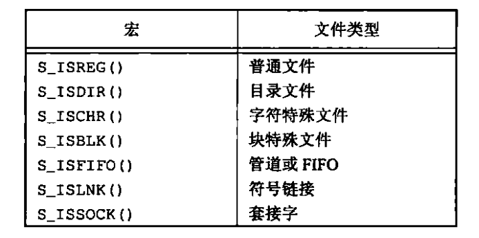
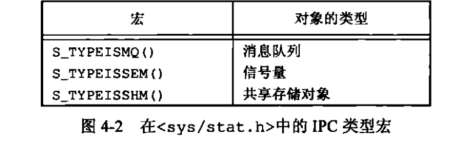
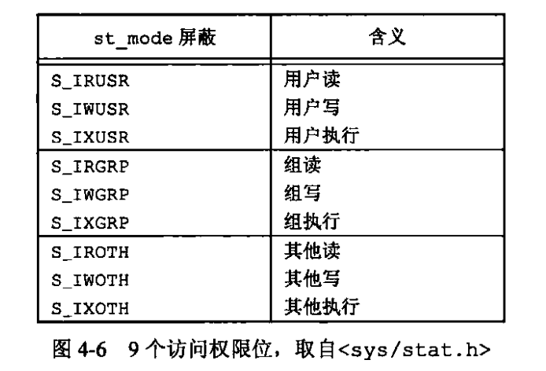
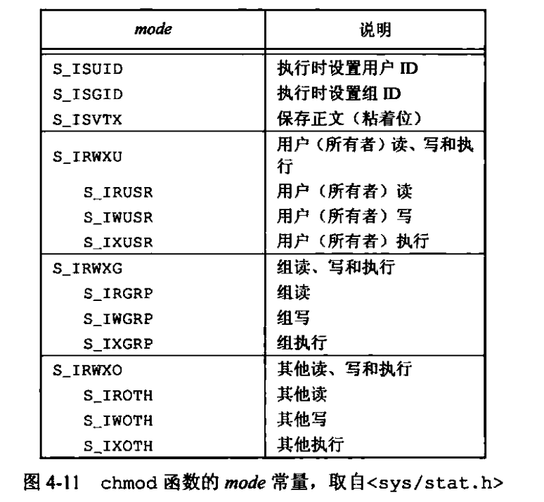
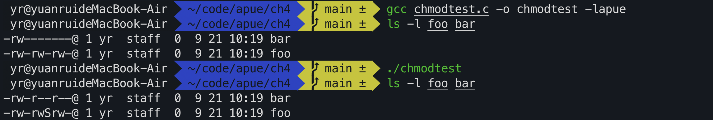

# Chapter4 文件和目录

### Intro 函数stat fstat fstatat lstat

```c
#include <sys/stat.h>
int stat(const char *restrict pathname, struct stat *restrict buf);//不会观察到符号链接
int fstat(int fildes, struct stat *buf);
int fstatat(int fd, const char *path, struct stat *buf, int flag);
int lstat(const char *restrict path, struct stat *restrict buf);//可以返回符号链接文件的链接有关信息，而不是该符号链接引用的文件的信息
```

`struct stat`的定义，man手册查询到的macos中的定义

```c
struct stat { /* when _DARWIN_FEATURE_64_BIT_INODE is NOT defined */
    dev_t    st_dev;    /* device inode resides on */
    ino_t    st_ino;    /* inode's number */
    mode_t   st_mode;   /* inode protection mode */
    nlink_t  st_nlink;  /* number of hard links to the file */
    uid_t    st_uid;    /* user-id of owner */
    gid_t    st_gid;    /* group-id of owner */
    dev_t    st_rdev;   /* device type, for special file inode */
    struct timespec st_atimespec;  /* time of last access */
    struct timespec st_mtimespec;  /* time of last data modification */
    struct timespec st_ctimespec;  /* time of last file status change */
    off_t    st_size;   /* file size, in bytes */
    quad_t   st_blocks; /* blocks allocated for file */
    u_long   st_blksize;/* optimal file sys I/O ops blocksize */
    u_long   st_flags;  /* user defined flags for file */
    u_long   st_gen;    /* file generation number */
};

struct stat { /* when _DARWIN_FEATURE_64_BIT_INODE is defined */
    dev_t           st_dev;           /* ID of device containing file */
    mode_t          st_mode;          /* Mode of file (see below) */
    nlink_t         st_nlink;         /* Number of hard links */
    ino_t           st_ino;           /* File serial number */
    uid_t           st_uid;           /* User ID of the file */
    gid_t           st_gid;           /* Group ID of the file */
    dev_t           st_rdev;          /* Device ID */
    struct timespec st_atimespec;     /* time of last access */
    struct timespec st_mtimespec;     /* time of last data modification */
    struct timespec st_ctimespec;     /* time of last status change */
    struct timespec st_birthtimespec; /* time of file creation(birth) */
    off_t           st_size;          /* file size, in bytes */
    blkcnt_t        st_blocks;        /* blocks allocated for file */
    blksize_t       st_blksize;       /* optimal blocksize for I/O */
    uint32_t        st_flags;         /* user defined flags for file */
    uint32_t        st_gen;           /* file generation number */
    int32_t         st_lspare;        /* RESERVED: DO NOT USE! */
    int64_t         st_qspare[2];     /* RESERVED: DO NOT USE! */
    };
```

### 1. 文件类型

1. 普通文件（regular file）
    最常用，包含了某种形式的数据。至于这种数据是文本还是二进制，对于Unix内核无区别。对于普通文件内容的解释由处理该文件的应用程序进行。对于二进制可执行文件，为了能执行，内核必须理解其格式，所以其必须遵循一种标准化的格式，使的内核可以确定程序文本和数据的加载位置

2. 目录文件（directory file）
    包含其他文件的名字以及指向与这些文件有关信息的指针。对于一个目录有读权限的进程都可以读该目录内容，但只有内核可以直接写目录文件。（进程必须通过这节介绍的系统调用才能改目录）

3. 块特殊文件（block special file）
4. 字符特殊文件（character special file）
5. FIFO
   用于进程间通信，有时称为命名管道（named pipe）
6. 套接字（socket）
   用于进程间网络通信，一台宿主机上进程间的非网络通信
7. 符号链接（symbolic link）
   这种类型的文件指向另一个文件

文件类型信息包含在`stat`结构体中的`st_mode`成员，可以用一下宏确定文件类型



利用以下的宏通过指向stat结构的指针可以确定IPC对象类型



示例程序filetype.c可以对每一个命令行参数打印文件类型


### 2. 文件访问权限

`st_mode`包含了对文件的访问权限位，所有文件类型都有访问权限（access permission），每个文件有9个访问权限位，通过以下宏确定



- 理解目录文件的读权限与执行权限
    用名字打开任意类型的文件时，对该名字包含的每一个执行目录，包括其可能隐含的当前工作目录都应具有执行权限（其常被称为搜索位）
    读权限允许我们目录，获得该目录文件中所有文件名的列表。
    目录的读和执行权限意义不同，读权限允许我们读目录中所有文件名列表，而执行权限使我们可以通过（搜索）该目录。即执行权限决定用户能否在该目录下创建修改删除文件

### 3. 函数umask 

umask函数为进程设置文件模式创建屏蔽字，并返回之前的值（无出错返回）

```c
#include <sys/stat.h>
mode_t umask(mode_t cmask);
```

umask： 文件模式创建屏蔽字

umask值控制创建文件的默认权限，其值为三位八进制如022，写成二进制 000 010 010 对应 rwx - rwx - rwx 用户/用户组/其他的读写执行权限，0为有该权限，1为取消（屏蔽对应权限），比如我们在c程序中通过系统调用创建RWRWRW权限的文件，但是其要经过umask对一些权限进行屏蔽，比如022就屏蔽了group和other的写权限，创建出来的文件权限为rw- r-- r--

在终端中有umask命令查看系统当前的umask值

umasktest.c即为使用umask函数的实例，运行的结果


当我们更改进程的文件模式创建屏蔽字（umask值），不影响父进程的屏蔽字（因为对于我们运行的umasktest程序，其修改了该进程的umask，而在shell中，即其父进程中，我们用umask命令查看，umask未改变）


### 4. 函数chmod，fchmod，fchmodat

用于更改现有文件的访问权限，具体使用看man手册

为了改变文件的权限位，进程的有效用户ID必须等于文件的所有者ID，或者该进程必须具有超级用户权限

参数mode是以下常量的按位或



chmodtest.c 为示例程序，运行结果如下



### 5. 粘着位

粘着位历史上的技术见apue page108

现在当前的系统扩展了粘着位的使用范围，如果对一个目录设置了粘着位，只有对该目录具有写权限的用户并满足下列条件之一，才能删除或者重命名该目录下的文件：
- 拥有此文件
- 拥有词目
- 是超级用户

/tmp /var/tmp是设置粘着位的经典目录，任何用户都可以在着两个目录中创建文件。任意用户对着两个目录的权限通常都是读、写和执行。但是用户不应能删除或者重命名，属于其他人的文件，为此在这两个目录的文件模式中设置了粘着位。


### 6. 软硬链接

硬链接：直接指向文件的i节点，通常要求链接和文件处于同一个文件系统，且只有超级用户才能创建指向目录的硬链接

软链接：符号链接，对一个文件的间接指针


......
