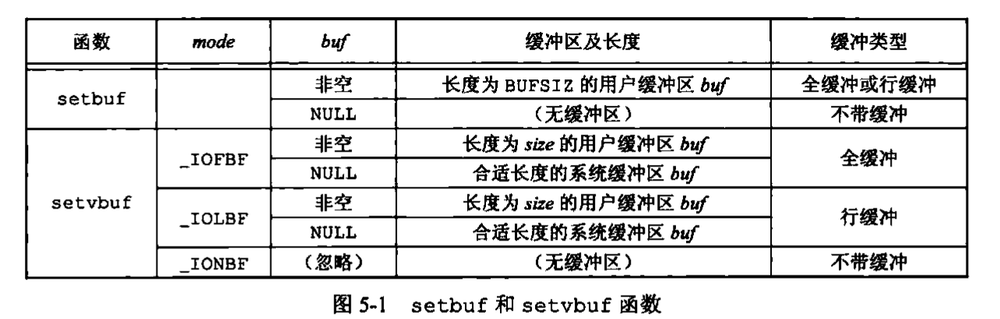

# Chapter 标准IO

### 1. 流与FILE对象

Chapter3中通过系统调用来做的IO都是围绕文件描述符进行的，对于标准IO库，其操作围绕流（stream）进行。

系统调用：打开文件——>返回文件描述符
标准IO：创建或者打开文件 ——> 使一个流与一个文件相关联

设置流的流向
```c
#include <stdio.h>
#include <wchar.h>
int fwide(FILE *fp, int mode);
```

打开一个流时fopen返回一个指向FILE对象的指针，该对象通常使一个结构，包含stdio为管理该流需要的所有信息：IO文件的fd、用于指向该流缓冲区的指针、缓冲区的长度，缓冲区的字符数以及出错标志等


### 2. 标准输入、输出、错误

进程预定义的三个流，通过文件指针stdin、stdout、stderr加以引用


### 3. 缓冲

标准IO库提供缓冲的目的：尽可能减少使用read和write的调用次数（通过系统调用和硬件交互的速度是慢的，我们希望一次性能read或write多的数据）

标准IO提供以下三种缓冲：

1. 全缓冲：填满标准IO的缓冲区后才进行实际的IO操作，在一个流上进行第一次IO操作时，相关标准IO函数通常通过malloc获得所需要使用的缓冲区
2. 行缓冲，流涉及一个终端时（标准输入/输出）常使用行缓冲
3. 不带缓冲：stderr通常不带缓冲，使的错误信息可以尽快显示

更改缓冲类型
```c
#include <stdio.h>
void setbuf(FILE *restrict fp, char *restrict buf);
void setvbuf(FILE *restrict fp, char* buf, int mode, size_t size);
```
mode参数来说明所系缓冲类型


强制冲洗一个流
```c
#include<stdio.h>
int fflush(FILE *fp)
```

### 总结标准IO

效率不高 —— 通常需要复制两次数据：
1. 内核与标准IO缓冲区之间
2. 标准IO的缓冲区和用户程序中的行缓冲区之间

