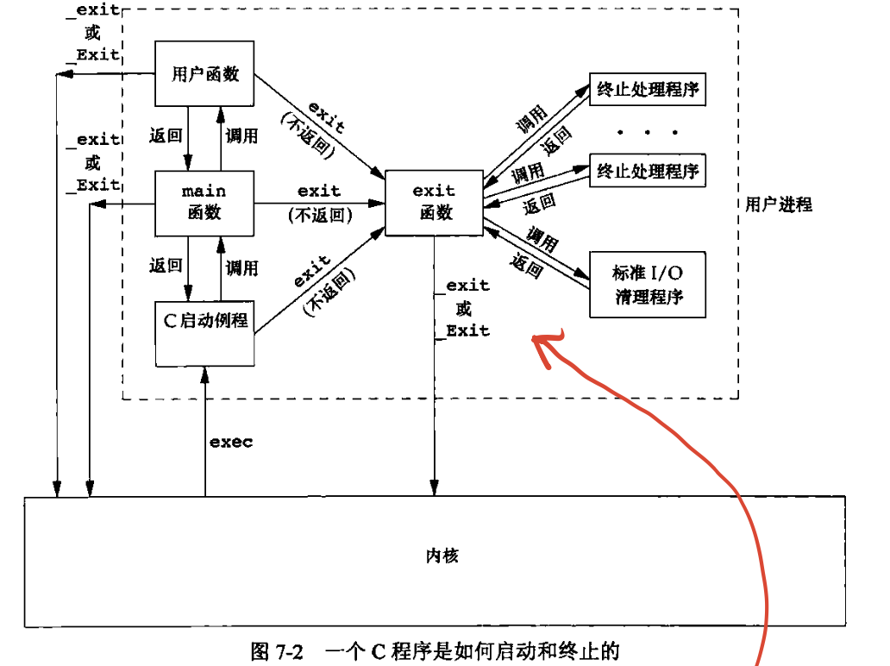
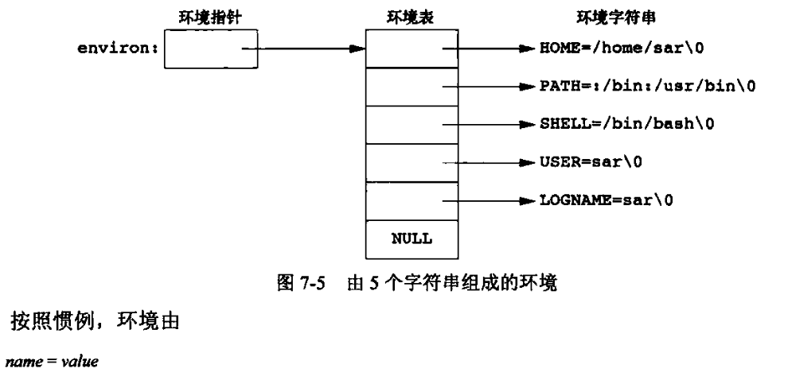
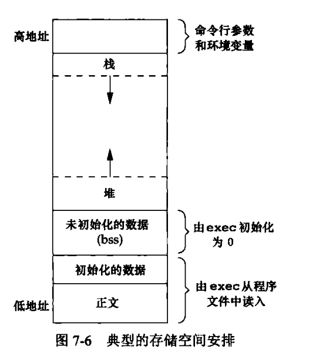

# 进程环境

### 1. 话题

- main函数的调用
- 命令行参数
- 进程存储空间布局与分配
- 环境变量


### 2.main函数

```c
int main(int argv, char *argv[]);
```

谁调用了main？ main的参数谁给的？

内核用exec执行c程序，调用main前先调用一个启动例程，启动例程从内核获取命令行参数和环境变量值，为调用main函数做好安排


对于启动例程，main返回后立即调用exit函数，与以下代码等效`exit(main(argc, argv))`

对于以下三个退出函数
```c
void exit(int status);
void _exit(int status);
void _Exit(int status);
```

前者先执行一些清理处理（标准IO库的清理关闭操作等，输出缓冲区的所有数据都被冲洗，即写到文件上），后两者立即进入内核

main函数return一个整型和直接用这个值exit等价

c程序的启动和终止



内核使程序执行的唯一方法是调用一个exec函数。进程**自愿终止**的唯一方式是显式或者隐式地（通过调用exit）调用_exit或者_Exit。进程也可以非自愿地由一个信号使其终止


### 3. 命令行参数

### 4. 环境表

大多数UNIX系统支持main函数带有三个参数，第三个参数就是环境表的地址

```c
int main(int argc, char *argv[], char *envp[]);
```

每个程序都接收到一张环境表（字符指针数组），全局变量environ包含该指针数组的地址



通过getenv和putenv函数访问特定环境变量

### 5. C程序的存储空间布局




