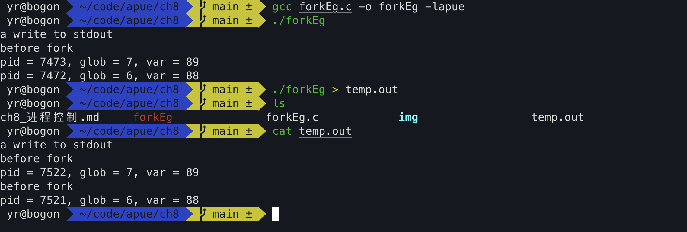
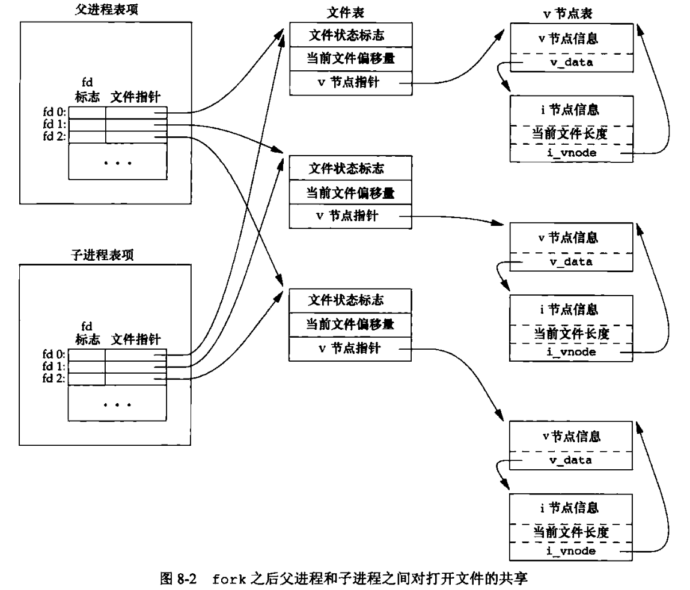

# 进程控制

### 1. 话题

fork创建进程，exec初始执行新的程序，exit和wait处理终止和等待终止

- 创建新进程
- 执行程序
- 进程终止
- 进程属性与进程控制
- 进程会计机制

### 2. fork

fork函数用于创建一个子进程

理解：fork调用一次返回两次

给父进程返回子进程的pid因为，父进程关心其pid且父进程不太好通过其他方式获得其子进程的pid，而给子进程返回零，因为子进程可获得自己已经父进程的pid，子进程不关心fork的返回值。

子进程是父进程的副本，获得父进程的数据空间、堆和栈的副本（不共享这些存储空间部分）共享的是正文段（代码段）

对于前面的部分（数据空间、堆、栈），使用写时拷贝（Copy-On-Write），使的两者共享这些区域，当其中任意一个试图修改时，内核只为修改区域的那块内存制作一个副本。 —— 读时共享，写时拷贝

通过forkEg.c程序来理解上面的内容

理解程序直接在终端输入和重定向到文件后输出结果的不同：write不带缓冲，而标准IO库带缓冲，而且标准输出是行缓冲，输出到文件是全缓冲的，子进程共享了printf中的缓冲区内容，在exit的最后，缓冲区被冲洗

当我们重定向父进程的标准输出时，子进程的标准输出也被重定向。

fork会将父进程的所有打开的文件描述符复制到子进程中，每一个相同的打开的文件描述符共享一个文件表项，也意味着两者共享一个文件偏移量

fork的两种常见用法：
1. 父进程希望复制自己，使父子进程执行不同的代码段。（例如网络服务进程中，父进程等待客户端的服务请求，请求到达时，父进程调用fork使子进程来处理这个请求，父进程继续等待下一个请求）
2. 一个进程要执行一个不同的程序。（例如shell，子进程从fork返回后立即调用exec进行进程程序替换）

考虑下面两种情况
1. 父进程在子进程终止前被终止：子进程成为孤儿进程，被pid=1的init的进程收养（保证每一个进程都有一个父进程）
2. 子进程在父进程终止前终止：父进程希望可以获取其退出的信息，但是父进程可能很忙不能在子进程终止时立刻获得其退出的信息。此时我们不能让终止的子进程消失，而是让进入僵死进程（zombie），此时其占用的资源还没释放，等到父进程准备好去检查子进程的退出信息，调用wait/waitpid获得其退出信息后，僵死进程才释放掉其占用的资源

特别的对于init进程收养的进程，其终止时不会变成僵死进程，因为init进程被设计为无论何时只要有一个进程终止，其就会调用一个wait函数来获取其终止状态，防止了系统中塞满僵死进程

（所以一个trick是当我们不关心我们子进程退出状态且不想进程等待，我们可以创建子进程后再由子进程创建孙子进程，孙子进程来执行相应的代码，我们终止子进程，让init进程收养孙子进程即可）

### 3. exec函数族

调用一种exec函数时，该程序执行的程序完全替换为新程序，新程序从main开始执行，exec不创建新进程，前后pid不变，其只是用磁盘上的一个新程序替换了当前进程的正文段（代码段）、数据段、堆段、栈段。

### 4. 进程会计

见apue page 269

### 5. 进程调度

UNIX历史上提供的只是基于调度优先级的粗粒度的控制，基于调整nice值选择以更低优先级运行（降低其对CPU的占用，因此该进程是“友好的”）

