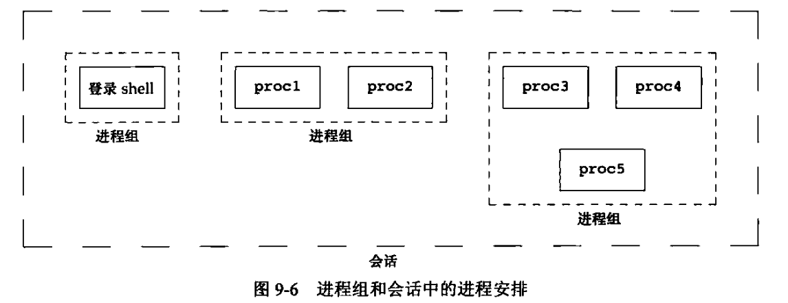
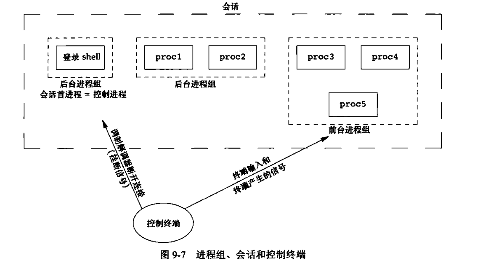

# 进程关系

### 1. 进程组

定义：一个或者多个进程的集合（同一个作业中结合起来的）

- 每一个进程组有一个组长进程，组长进程的进程ID等于进程组ID
- 只要在某个进程组中有一个进程存在，该进程组就存在，与组长进程是否终止无关

### 2. 会话（session）

定义：一个或者多个进程组的集合



shell的管道将几个进程编成一组

```shell
proc1 | proc2 & proc3 | proc4 | proc5
```

进程通过调用setsid函数建立一个新的会话

控制终端、进程组、会话




